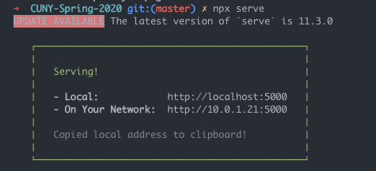

# Basic Server

Since we will be loading in data files, we need to use a basic server to serve our local files to the browser. To do this, follow the steps below. If you are interested, you can read more about why this is the case [here](https://developer.mozilla.org/en-US/docs/Learn/Common_questions/How_does_the_Internet_work), [here](https://developer.mozilla.org/en-US/docs/Learn/Common_questions/What_is_a_web_server), and [here](https://developer.mozilla.org/en-US/docs/Learn/Common_questions/set_up_a_local_testing_server).

Before you start, you will need to install [serve](https://github.com/zeit/serve#readme), which is a library for written for running a simple NodeJS server. Luckily, since we already have Node installed, we also have access to `NPM,` or Node Package Manager, which we can use to install serve and all of its dependencies. To do that, running the following from your terminal/commamd line:

```sh
# goes through and installs the library and all of its dependencies
$ npm install -g serve
```

Once your installations are complete and you're ready to begin working on your tutorial assignment, use your terminal (or git bash, on PC) to navigate to the _root directory_ of your fork. Your path may look different, but the command will be something like this:

```sh
$ cd Documents/My\ Repositories/Interactive-Data-Vis-Sp2020/
```

From this level, (_not from the tutorial folder_), run:

```sh
$ serve
```

This will start a [simple web server](https://github.com/zeit/serve#readme) that will serve the course files. After you run this line you should see something like the following:



Your files will now be available if you go to the following address in your browser `http://localhost:5000`.

When you open `http://localhost:5000/`, you should see your repository's folder structure. Click into that week's tutorial. The file showing is your `index.html` file. If you want to view the class demo file, you can change your URL path. For example: `http://localhost:5000/TUTORIAL_PATH/demo`.
