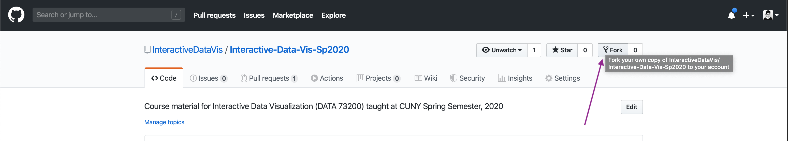
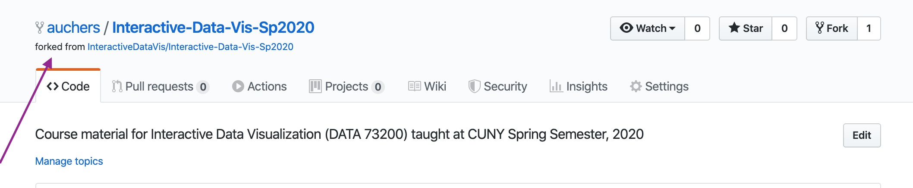
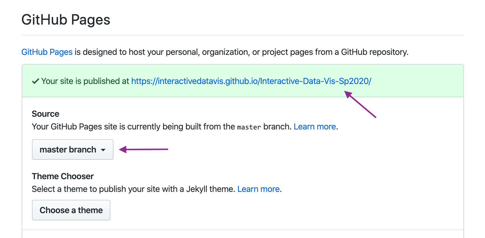

# Github Setup

You can read more about forking, syncing, and our overall github flow [here](https://help.github.com/en/github/getting-started-with-github/fork-a-repo).

### 1. On Gitub, go to our [Class Repository](https://github.com/InteractiveDataVis/Interactive-Data-Vis-Sp2020).

### 2. Fork this repository into your own account.



You will now have a copy of the course repository on your own github account. For example:



### 3. On GitHub, navigate to **your fork** of the repository and clone it to your local computer.

```sh
# from Terminal:

# clone your fork to your local computer
$ git clone https://github.com/YOUR_USERNAME/Interactive-Data-Vis-Sp2020

# `cd` (change directory) into this repository
$ cd Interactive-Data-Vis-Sp2020
```

### 4. Set up your local repository so that it links back to the course repository.

We do this so that you can keep your local branch synced up with the main course repository as we update the material.

See current remote branches:

```sh
$ git remote -v
> origin	https://github.com/YOUR_USERNAME/Interactive-Data-Vis-Sp2020 (fetch)
> origin	https://github.com/YOUR_USERNAME/Interactive-Data-Vis-Sp2020 (push)
```

Add an `upstream` remote branch so you can keep yours synced with the main class repository:

```sh
$ git remote add upstream https://github.com/InteractiveDataVis/Interactive-Data-Vis-Sp2020.git
```

Check remote branches again to ensure that the update worked. You should see 2 sets of branches, `origin` which links back to your fork, and `upstream` which references back to the course repository:

```sh
$ git remote -v
> origin	https://github.com/YOUR_USERNAME/Interactive-Data-Vis-Sp2020 (fetch)
> origin	https://github.com/YOUR_USERNAME/Interactive-Data-Vis-Sp2020 (push)
> upstream	https://github.com/InteractiveDataVis/Interactive-Data-Vis-Sp2020.git (fetch)
> upstream	https://github.com/InteractiveDataVis/Interactive-Data-Vis-Sp2020.git (push)

```

### 5. Keep your branch [synced](https://help.github.com/en/github/getting-started-with-github/fork-a-repo#keep-your-fork-synced).

Make sure to do this before working on new code (before each tutorial) to ensure that you are working off of the latest updates.
We will be updating the course repository throughout the semester, and this command will update your fork to include the changes we made, including that week's class example or other materials we have added.

```sh
# pulls the upstream changes and stores them in `upstream/master`
$ git fetch upstream
```

```sh
# merges the changes from upstream into your current branch
$ git merge upstream/master
```

(You can read more information about this [here](https://help.github.com/en/github/collaborating-with-issues-and-pull-requests/syncing-a-fork))

### 6. Push up and deploy your changes

[Note: VS Code has some great [tools](https://code.visualstudio.com/docs/editor/versioncontrol#_git-support) built in to help with this process.]

When you have made a change that you want to keep, you can commit your changes:

```sh
# see which files have changes associated with them
git status

# add, or 'stage', files or folders for this commit
git add [path/fileName]

# commit the files with a brief explanation of what you are changing
# ex: `git commit -m 'add bar chart legend`
git commit -m 'message regaring what changes you are commiting'
```

When you are ready to push up your code to your remote repository, you can run:

```sh
$ git push
```

To deploy your site on [Github Pages](https://help.github.com/en/github/working-with-github-pages/creating-a-github-pages-site#creating-your-site) you can go to your repository's `Settings` tab and then scroll down to `GitHub Pages` section. Select `master branch` as source and then your site will be avallable at `https://<user>.github.io/<repository>/`



**That's it! Now you are ready to create, update, and deploy your own websites 🎉!**
